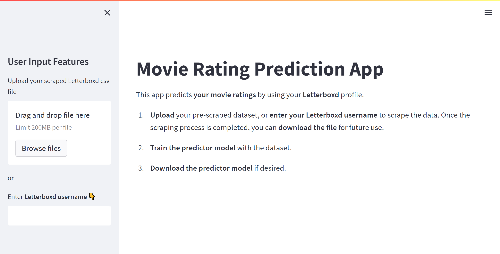
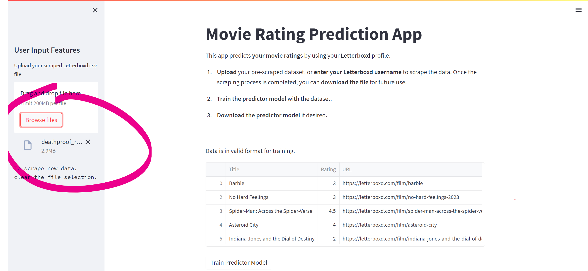
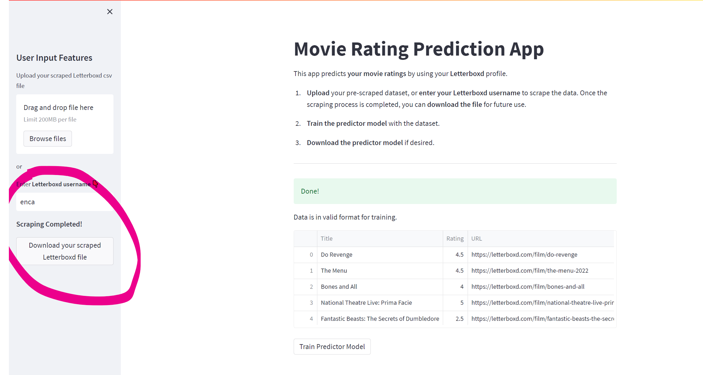
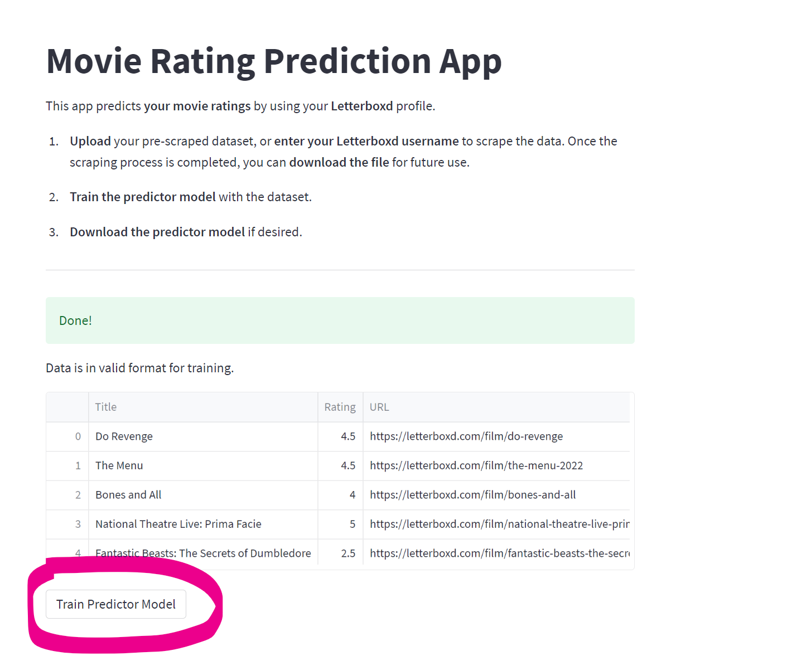
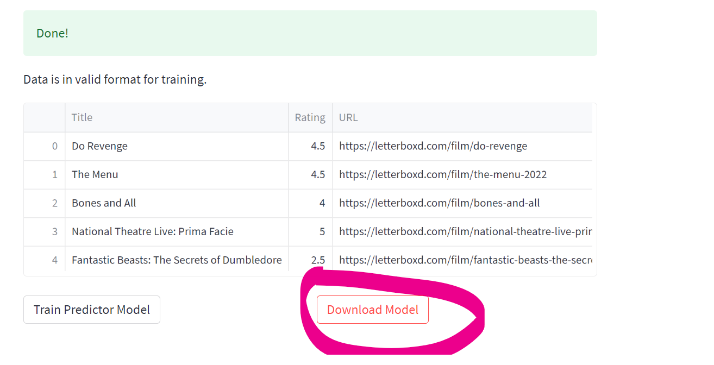

# Movie Matchmaker App on Streamlit

#### Here I created a Streamlit app to scrape your Letterboxd profile and train the predictor model using Streamlit UI.
#### To run the app use the **streamlit run movie_app.py** command on console.
---
## Step 1: Go into Main Screen with the localhost url on console

## Step 2: Upload Scraped Profile or Enter LetterBoxd Username to Scrape the Profile From Scratch

## OR

## Step 3: Train Model

## Step 4: Download Model if youd like to use for later

